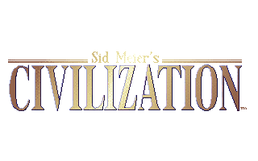
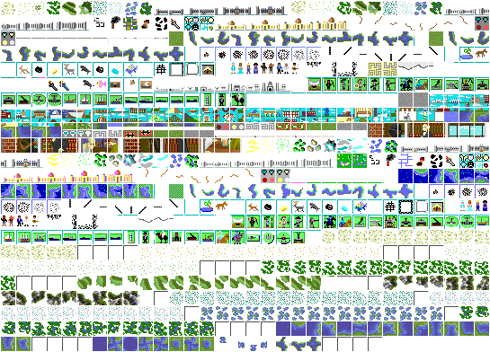
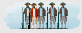

# civ-extract



Extract all graphics assets from the DOS game **Sid Meier's Civilization (1991)**,
with a full sprite index. Written in Common Lisp as an ASDF system; dependencies
are managed with [ocicl](https://github.com/ocicl/ocicl).



*The master `atlas.png`: all 729 terrain, unit and city sprites from `SP257`,
`SP299`, `SPRITES` and `TER257`.*

## What it does

* Decodes every `*.PIC` file (107 of them) to a PNG.
* Slices the known sprite sheets into individual 16×16 tiles.
* Renders **one master `atlas.png`** containing every sprite.
* Writes **`sprite-index.json`** describing every asset and sprite.

## The file format

Civilization's `.PIC`/`.PAL` files use MicroProse's IFF-like chunked container.
Each chunk is `[u16 magic][u16 length][length bytes]`:

| magic | id | meaning |
|-------|----|---------|
| `0x304D` | `M0` | 256-entry VGA palette (6-bit RGB, ×4 to 8-bit) |
| `0x3045` | `E0` | 8bpp→4bpp colour-conversion table (not needed for output) |
| `0x3058` | `X0` | 8bpp image — `LZW` then `RLE` compressed |
| `0x3158` | `X1` | 4bpp image — `LZW` then `RLE` compressed |

The image chunk body is `width(u16) height(u16) bits(u8)` followed by the
compressed stream. **LZW**: codes packed LSB-first, min 8 / max 11 bits, no
clear code, code `256` ends the stream, dictionary resets when the code width
would exceed 11 bits. **RLE**: `0x90 N` repeats the previous byte to N copies
total; `0x90 0x00` is a literal `0x90`. Colour index 0 is transparent.

(Algorithm matches the CC0-licensed [CivOne](https://github.com/SWY1985/CivOne)
reference decoder.)

## Running it

ocicl has already fetched `zpng` and `com.inuoe.jzon` into `ocicl/`
(see `ocicl.csv`). To re-fetch on a fresh checkout:

```sh
ocicl install zpng com.inuoe.jzon
```

Then run the batch extractor from this directory (edit the `:source-dir` in
`run.lisp` to point at the game's `.PIC` files — default `~/Projects/CIVILIZATION/`):

```sh
sbcl --non-interactive --load run.lisp
```

Output lands in `extracted/`:

```
extracted/
  images/<NAME>.png        # every PIC as a full RGBA image
  sprites/<SHEET>/tile_RRR_CCC.png   # individual sprite tiles
  atlas.png                # all sprites rendered onto one sheet
  sprite-index.json        # index of every asset + sprite
```

## API

```lisp
(asdf:load-system :civ-extract)

;; extract everything
(civ-extract:extract-all :source-dir #p"../" :out-dir #p"extracted/")

;; decode a single file to a PIC struct
(civ-extract:parse-pic "../SP257.PIC")   ; => #S(PIC :width 320 :height 200 ...)
```

`extract-all` keywords: `:write-tiles` (default `t`), `:skip-blank` (skip
fully-transparent tiles, default `t`), `:atlas-columns` (default `32`).

## Sprite sheets that get sliced

A single sliced tile (`sprites/ICONPGA/tile_000_000.png`, cut from the `ICONPGA`
page):



Tile geometry lives in `*sprite-sheets*` (`src/sprites.lisp`):

* **16×16 game sheets** — `SP257`, `SP299`, `SPRITES`, `TER257` (terrain, units,
  city graphics). These feed the master `atlas.png`.
* **ICONPG civilopedia pages** — `ICONPG1`–`ICONPG8` (3×3 improvement/category
  icons), `ICONPGA`–`ICONPGE` (2-column unit illustrations), `ICONPGT1`/`T2`
  (3×2 map previews). These are large tiles, so they're sliced and indexed but
  kept out of the 16×16 atlas (`:in-atlas nil`).

Add a `make-sheet-spec` entry to slice another file, e.g.:

```lisp
(make-sheet-spec "CITYPIX1" :tile-w 32 :tile-h 24 :cols 8 :rows 6
                 :in-atlas nil :label "city graphics")
```

`make-sheet-spec` keys: `:tile-w` `:tile-h` `:origin-x` `:origin-y` `:gap-x`
`:gap-y` `:cols` `:rows` `:label` `:in-atlas`. When `:cols`/`:rows` are omitted
they're computed from the image size and tile pitch.
